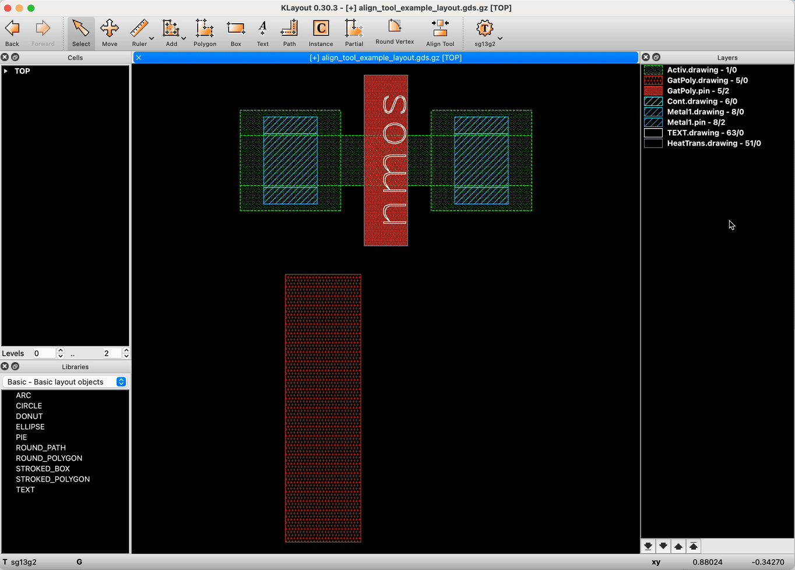
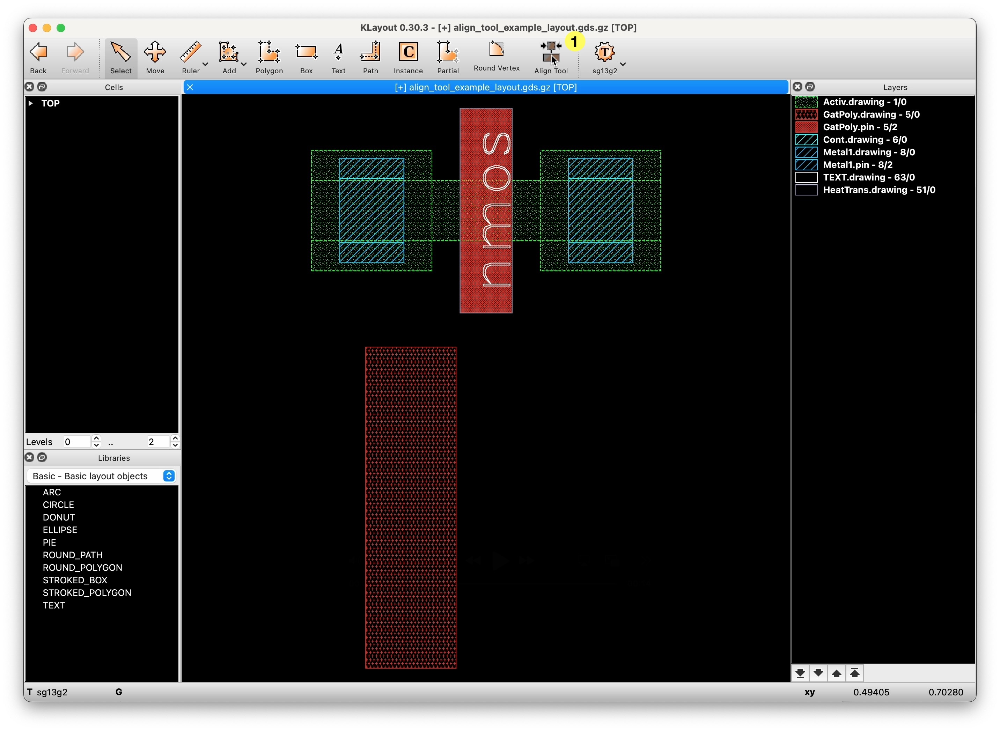
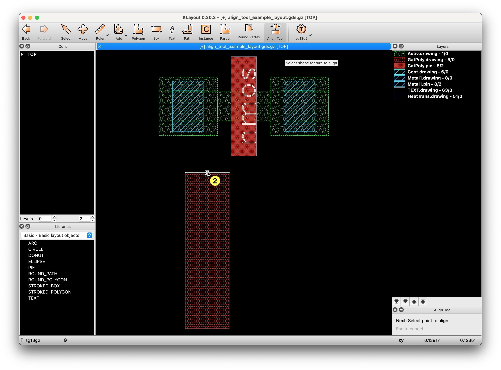
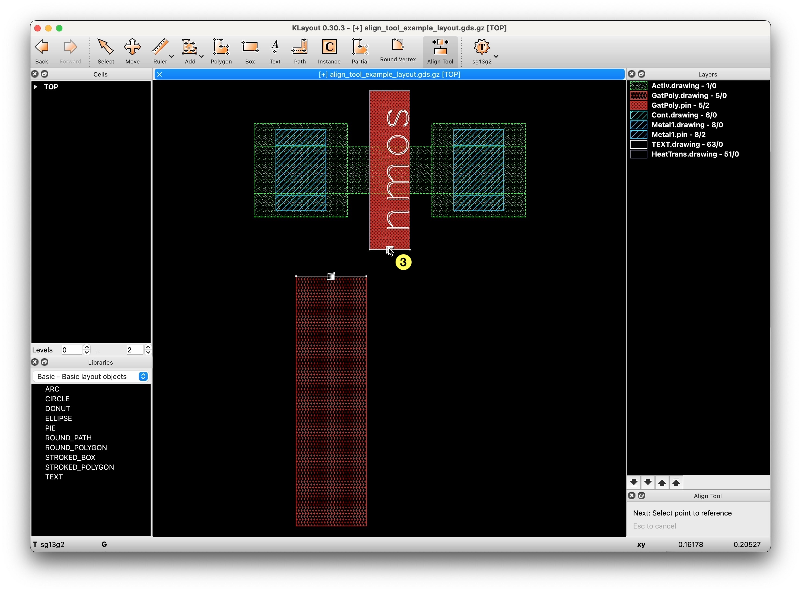
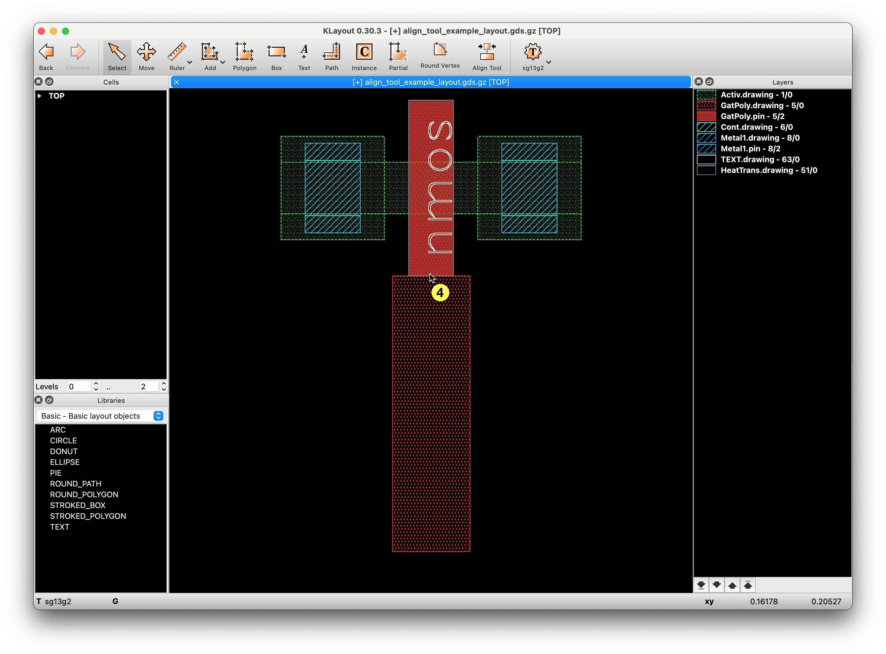
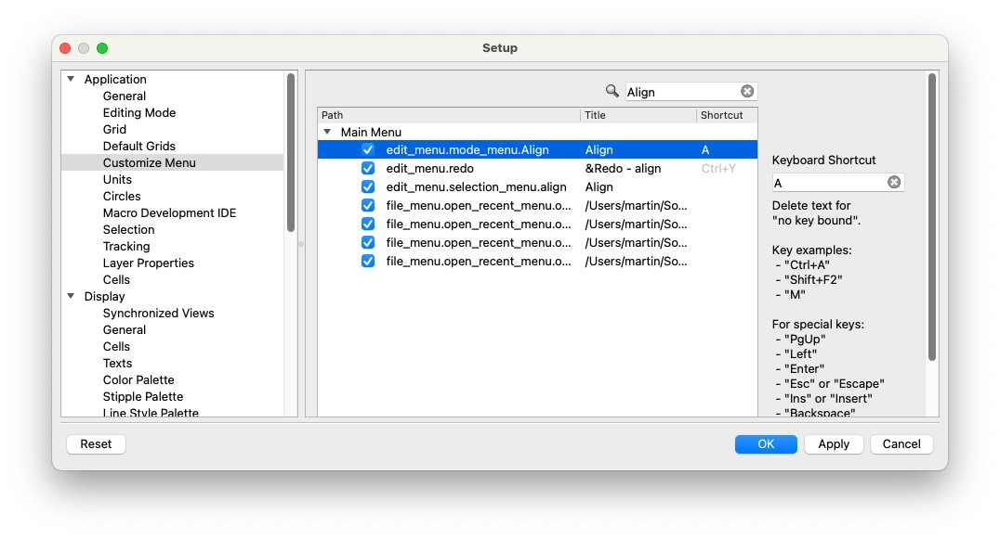
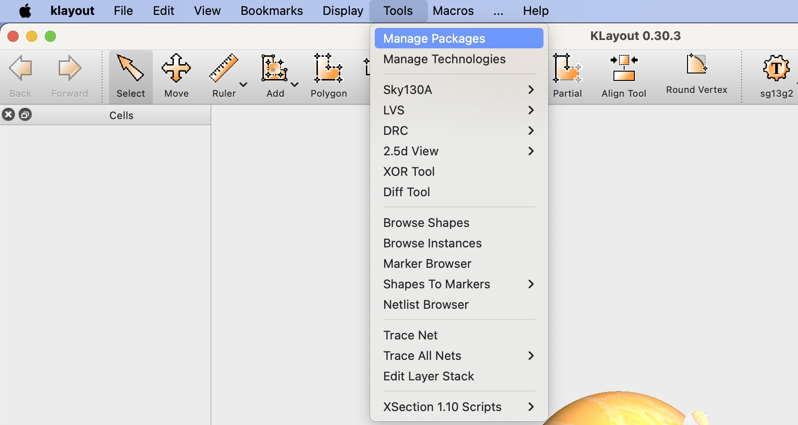
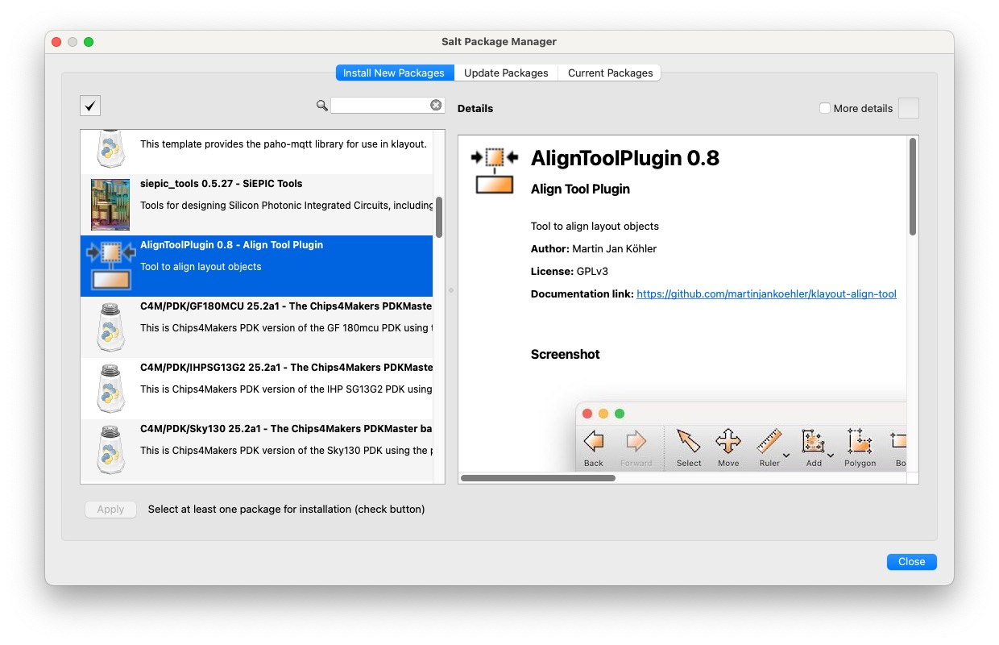
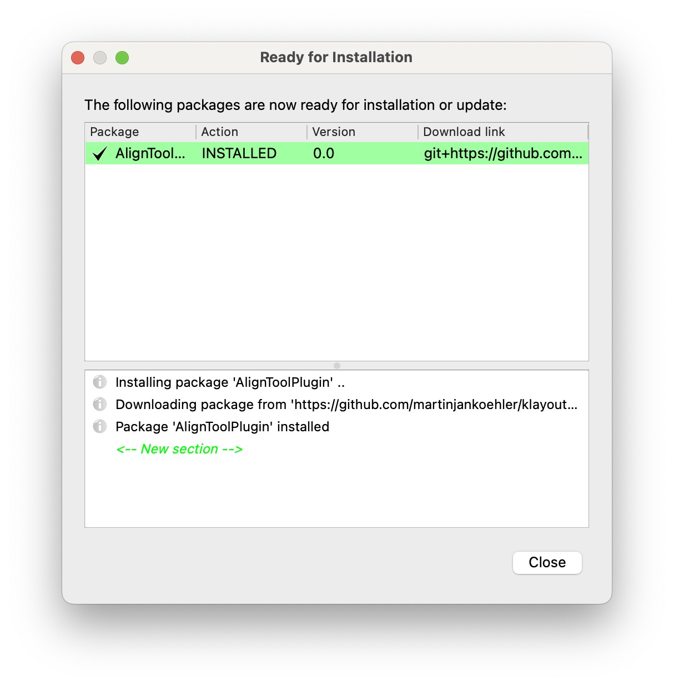
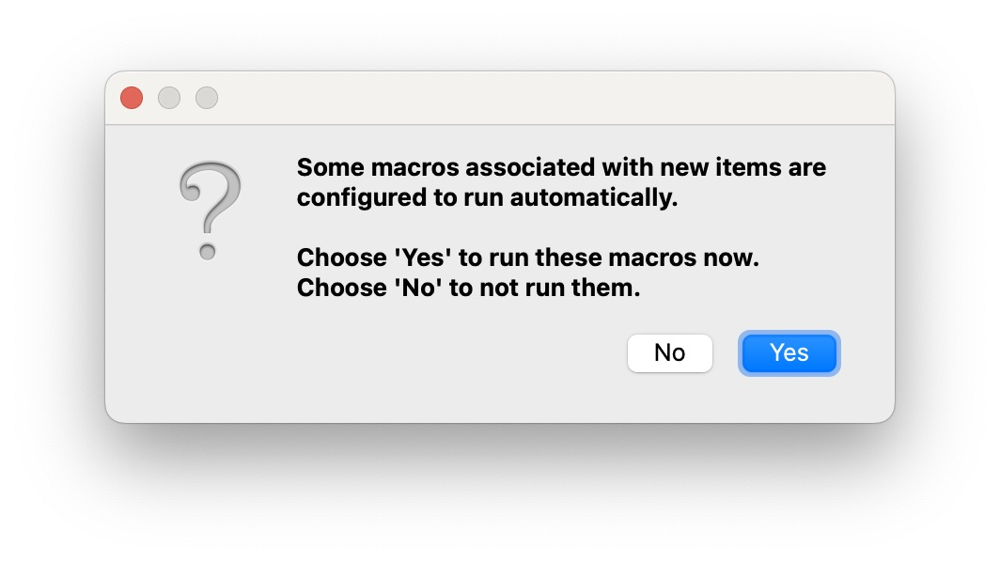

# KLayout Plugin: Align Tool

* Boost your layout productivity with quick alignments of layout elements, such as
   * cell instances
   * shapes (e.g. polygons, boxes, paths)
* Choose constraints by selecting features, such as
   * edges (the entire edge) 
   * points (edge end points or the edge middle point)

This add-on can be installed through [KLayout](https://klayout.de) package manager, [see installation instructions here](#installation-instructions)

After installation, this tool can be accessed through *Toolbar*→*Align*

---

## Table of Contents
- [Usage](#usage)
  - [Pre-selection](#pre-selection)
  - [Selecting features (when tool is active)](#selecting-features-when-tool-is-active)
  - [Example 1: point-to-point alignment](#example-1-point-to-point-alignment)
  - [Example 2: edge-to-edge alignment](#example-2-edge-to-edge-alignment)
- [Pro-Tip: assign key binding `A` to the tool](#pro-tip-assign-key-binding-a-to-the-tool)
- [Installation using KLayout Package Manager](#installation-using-klayout-package-manager)

---

## Usage

### Pre-selection

- You can select instances and shapes (you want to align), before invoking the tool
   - The selection will be displayed in the dock setup panel
- If no pre-selection is made, the shape or instance of the source reference point will be aligned

### Selecting features (when tool is active)

- Either points or edges can be chosen as the alignment reference
- Select the midpoint or one of the endpoints of an edge of a shape or instance bounding box
- The search box is shown as a dashed rectangle
   - points must be within the search box
   - edges just intersect the search box
- Left-click to apply the selection

### Example 1: point-to-point alignment

1. Ensure there is no pre-selection
2. Click the *Align* tool or press `A` to enter the align mode (if you've configured the key binding [as explained here](#shortcut)

3. Select feature of the shape to be moved/aligned

4. Select feature of the other shape that acts as the target reference

5. Left-click to apply the alignment 

6. Alternatively, press Esc to cancel the operation

### Example 2: edge-to-edge alignment

- edges must be parallel
- if the edge is too short and a point is always marked for selection, zoom in
- in edge-to-edge mode, alignment is performed only along the perpendicular axis, so
   - for horizontal edges: in the Y direction
   - for vertical edges: in the X direction

## Pro-Tip: assign key binding `A` to the tool

- In the main menu, open the Preferences/Settings in KLayout
- Navigate to *Application*→*Customize Menu*
- Search for 'Align'
- Assign the shortcut `A` to the path `edit_menu.mode_menu.Align`

## Installation using KLayout Package Manager

1. From the main menu, click *Tools*→*Manage Packages* to open the package manager

2. Locate the `AlignToolPlugin`, double-click it to select for installation, then click *Apply*

3. Review and close the package installation report

4. Confirm macro execution

